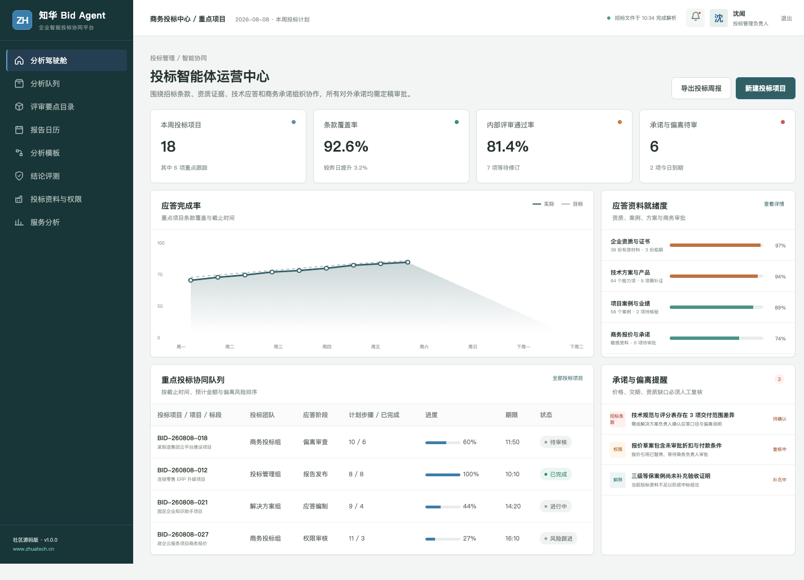
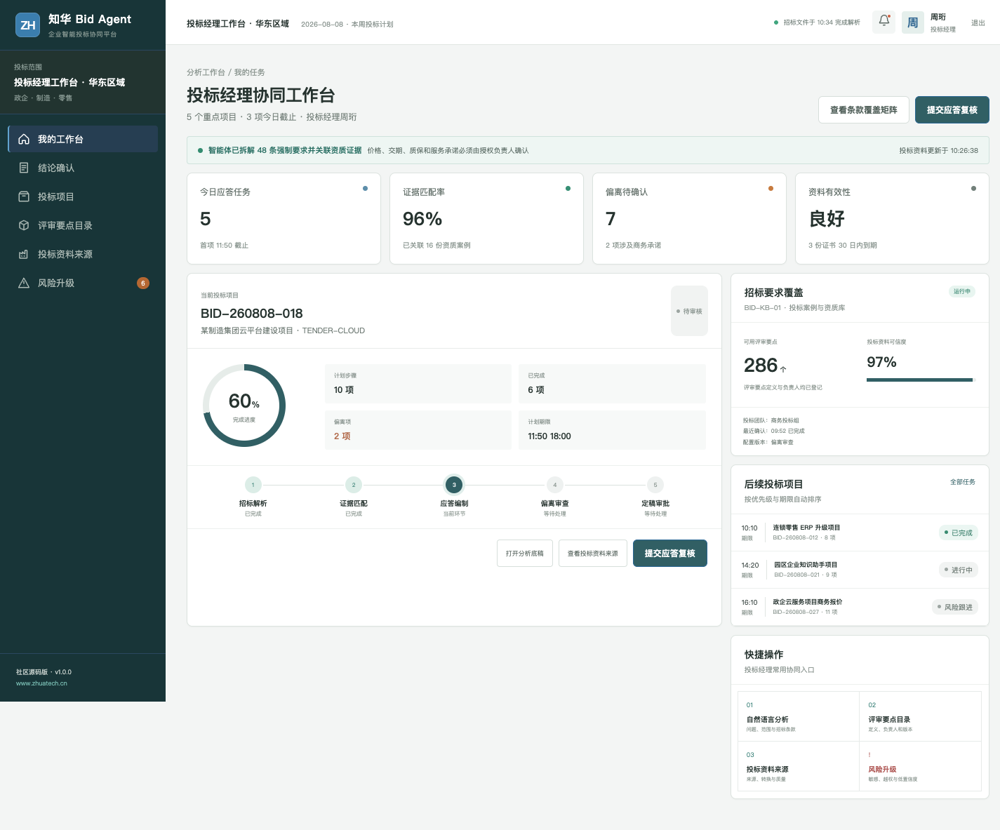

# BidAgent｜知华科技智能投标协同平台

## 企业级投标合规闸门

新增强制文件、利益冲突、签署授权、截标时限、毛利底线和安全条款检查，详见 [投标合规闸门](docs/ENTERPRISE_BID_COMPLIANCE.md)。

> 招标文件可以很长，但每一条应答都应该有来源、责任人与审批记录。

[知华科技（上海如静知华信息科技有限公司）官网](https://www.zhuatech.cn/)｜企业 AI 转型、Agent 定制、私有化部署、软件实施与项目外包

BidAgent 是面向售前、投标经理、解决方案和商务评审团队的社区源码项目。它把招标解析、资质复用、技术应答、偏离检查、商务承诺和定稿审批放在一条可追溯的协同链路中。

## 投标作战视图

管理端按截止时间、预计金额与偏离风险组织重点项目，集中查看条款覆盖、资质证据和商务审批。

业务端保留“招标解析—证据匹配—应答编制—偏离审查—定稿审批”五个环节，智能体不直接对外承诺价格、交期、质保或服务范围。

## 能力清单

- 招标文件章节与强制条款拆解
- 应答任务分工和截止时间管理
- 企业资质、案例与方案组件复用
- 技术偏离与资质缺口提示
- 报价、交期、质保及服务承诺人工门禁
- 版本指纹、引用页码与审批记录留痕

后端包含 `BidProposalGuardService`：根据条款覆盖、资质缺口、价格承诺与负责人审批给出透明路由，不调用真实模型，也不自动提交投标文件。

## 工程结构

| 部分 | 实现 |
| --- | --- |
| 前端 | Vue 3、Pinia、Vue Router、Axios、Vite，支持桌面与 H5 |
| 后端 | Java 21、Spring Boot、Spring Security、JWT、JPA |
| 数据库 | MySQL 8、Flyway；测试使用 H2 |
| Agent | 可替换 `AgentRuntime`，默认是本地可解释演示执行器 |
| 交付 | Docker Compose、Nginx、CI、API/架构/数据库/部署文档 |

~~~bash
cd frontend
npm install
npm run dev:demo
~~~

访问 `http://localhost:5173`。管理端账号 `planner / Demo@2026`，投标经理端账号 `operator / Demo@2026`。

## 使用边界与授权

本工程采用知华科技社区源码许可，**仅限个人学习、研究和非商业技术交流，不得商用**。企业内部使用、生产部署、SaaS、项目交付、收费服务、二次销售、品牌替换等商业用途，必须事先取得上海如静知华信息科技有限公司书面授权，详见 [LICENSE](LICENSE)。

深度开发、投标 Agent 定制、私有化部署和软件项目外包，请访问[知华科技官网](https://www.zhuatech.cn/)或扫码咨询。

| 商务与技术咨询 | 项目合作咨询 |
| --- | --- |
|  |  |

SEO：智能投标 Agent、标书生成系统、招标文件解析、投标管理软件、Java Vue AI 项目、知华科技、上海如静知华信息科技有限公司。
